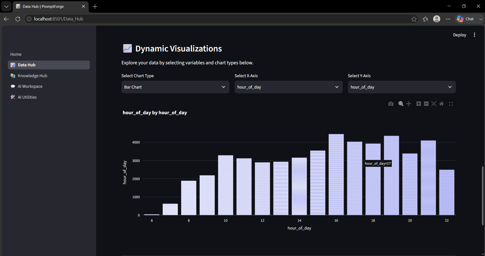
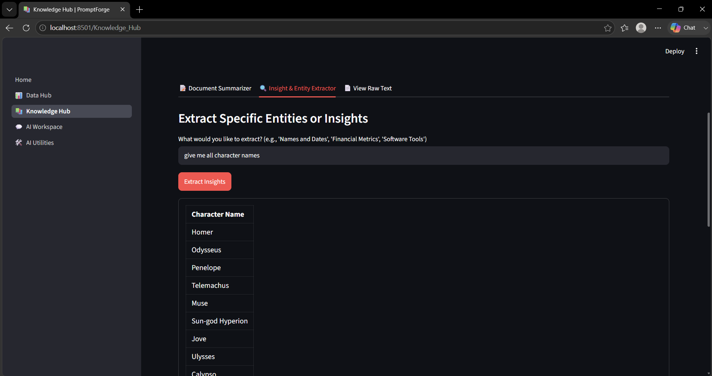
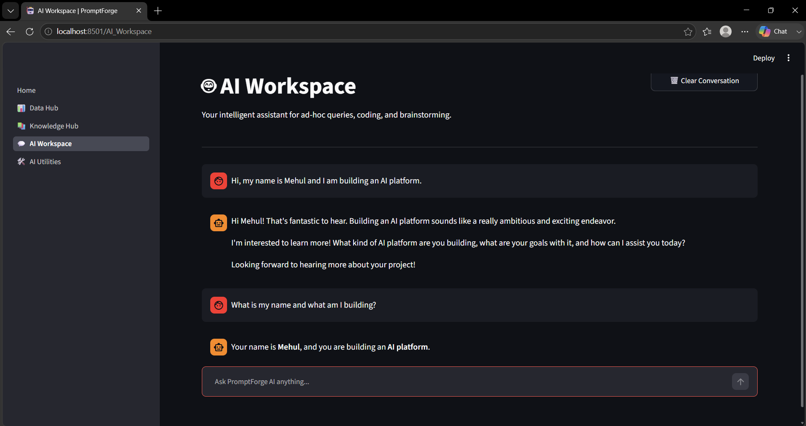

# ⚡ PromptForge AI


An advanced Data Intelligence Platform designed to bridge the gap between raw datasets and actionable business insights. Built with a clean **Streamlit** architecture and powered by the **Google Gemini 2.5 Flash** AI engine.

---

## 📸 Platform Overview

### 1. The Data Hub
*(Upload, analyze, and profile raw datasets instantly)*
<div align="center">
  
</div>

### 2. Knowledge Hub & AI Workspace
*(Interact with data, generate insights, and isolate context)*
<div align="center">
  
  
</div>

---

## 🚀 Core Mechanics

* **Automated Profiling:** Instant Exploratory Data Analysis (EDA) and dynamic KPI generation.
* **Dynamic Visualizations:** Interactive charting and graphing using Plotly to bring numbers to life.
* **AI Business Insights:** Executive summaries generated directly from raw datasets without manual prompting.
* **Context Isolation:** Protecting data integrity via advanced Prompt Engineering pipelines.

## 🛠️ Technology Stack

* **Frontend:** Streamlit
* **AI Engine:** Google Gemini 2.5 Flash API
* **Data Processing:** Python, Pandas
* **Visualization:** Plotly

---

## 💻 Local Installation

To run PromptForge AI locally on your machine:

1. **Clone the repository:**
   ```bash
   git clone [https://github.com/mehulchavan11/PromptForge-AI.git](https://github.com/mehulchavan11/PromptForge-AI.git)
   cd PromptForge-AI
   Activate your virtual environment:

Bash
# On Windows
.\venv\Scripts\activate
Install dependencies:
(Ensure you have your requirements.txt ready)

Bash
pip install -r requirements.txt
Run the application:

Bash
streamlit run Home.py
👨‍💻 Author
Mehul Chavan

GitHub: @mehulchavan11
